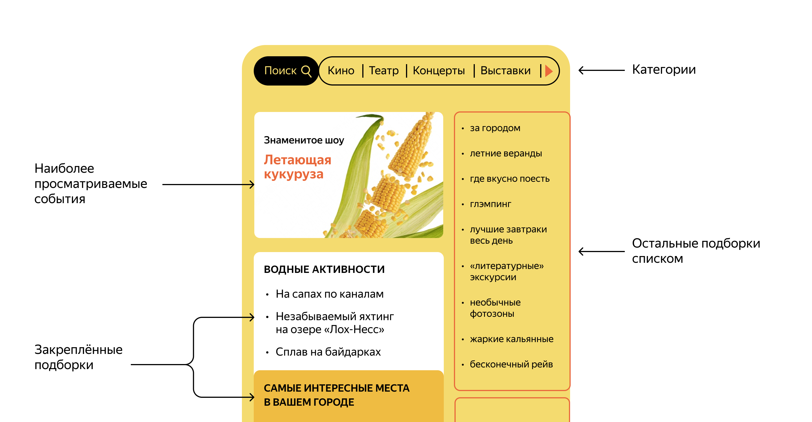

Template repository for ExploreWithMe project.

Добро пожаловать в репозиторий проекта java-explore-with-me!

**Стек технологий:** Java 11, Spring Boot, Maven, JPA, Hibernate, PostgreSQL, Docker, Lombok

**Микросервисная архитектура**
Приложение состоит из 2 сервисов:

_stats-service_ - часть приложения, которая собирает, хранит и отдает по запросу статистику по просмотрам.

_main-service_ - основная часть приложения, в которой происходит вся логика приложения.

----
Данное приложние решает такую проблему как планирование своего времяпровождения,
Сложнее всего в таком планировании поиск информации и переговоры. Нужно учесть много деталей: какие намечаются мероприятия, свободны ли в этот момент друзья,
как всех пригласить и где собраться.

Приложение является афишой, В этой афише можно предложить какое-либо событие от выставки до похода в кино и собрать компанию для участия в нём.


----
Приложение умеет:

1.Собирать статистику по просмотрам (по URL) как уникальных ip пользователей, так и наоборот

2.Добавлять, удалять, обновлять Пользователей

3.Добавлять, удалять, обновлять, События

4.Добавлять, удалять, обновлять, Запросы на события, подтвержать их и отколнять

5.Генерировать , создавать, обновлять полборки исходя из желания пользователей

5.Находить события по датам, описанию и др параметрам

6.Отмечать просмотры для каждого события

7.Подтврждать или удалять запросы в Событиях

8.Создавать, обновлять или удалять Категории для Событий

9.Создавать, обновлять, получать, удалять Комментарии для Событий , а так же получать комметарияя текущего события или для определенного пользователя

**Установка и запуск проекта**

Необходимо настроенная система виртуализации, установленный Docker Desktop(скачать и установить можно с официального сайта https://www.docker.com/products/docker-desktop/)

1. Клонируйте репозиторий проекта на свою локальную машину:
   ```git clone git@github.com:Romangolodyuk25/java-explore-with-me.git```
2. Запустите коммандную строку и перейдите в коррень директории с проектом.
3. Соберите проект
   ```mvn clean package```
4. Введите следующую команду, которая подготовит и запустит приложение на вашей локальной машине
   `````$  docker-compose up`````
5. Приложение будет запущено на порту 8080. Вы можете открыть свой веб-браузер и перейти по адресу http://localhost:8080,
   чтобы получить доступ к приложению Explore With Me.

Схема Баз данных Основного сервиса:

 ----
Схема Базы данных сервиса статистики:
